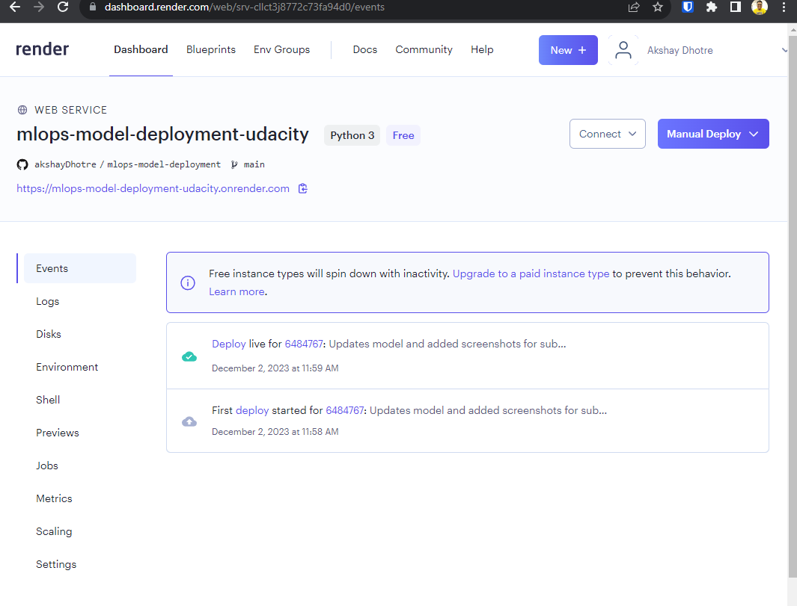
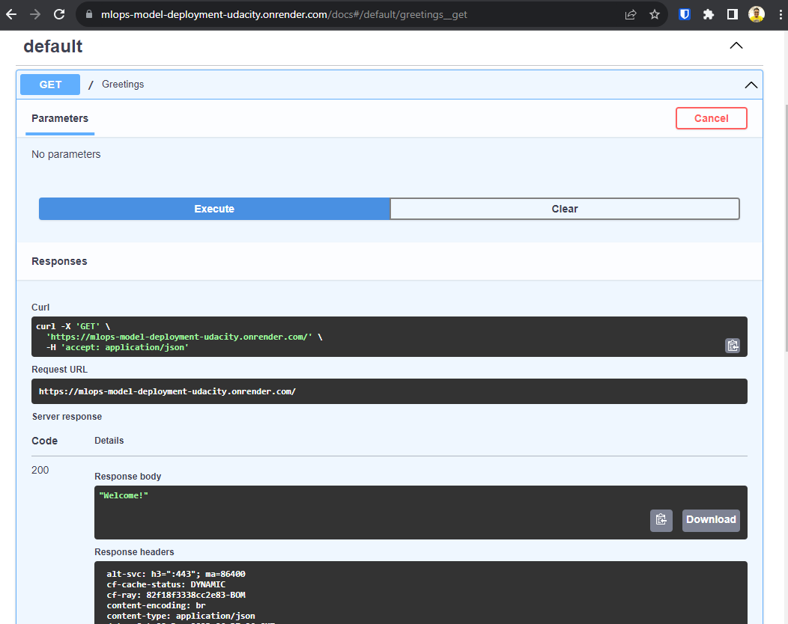
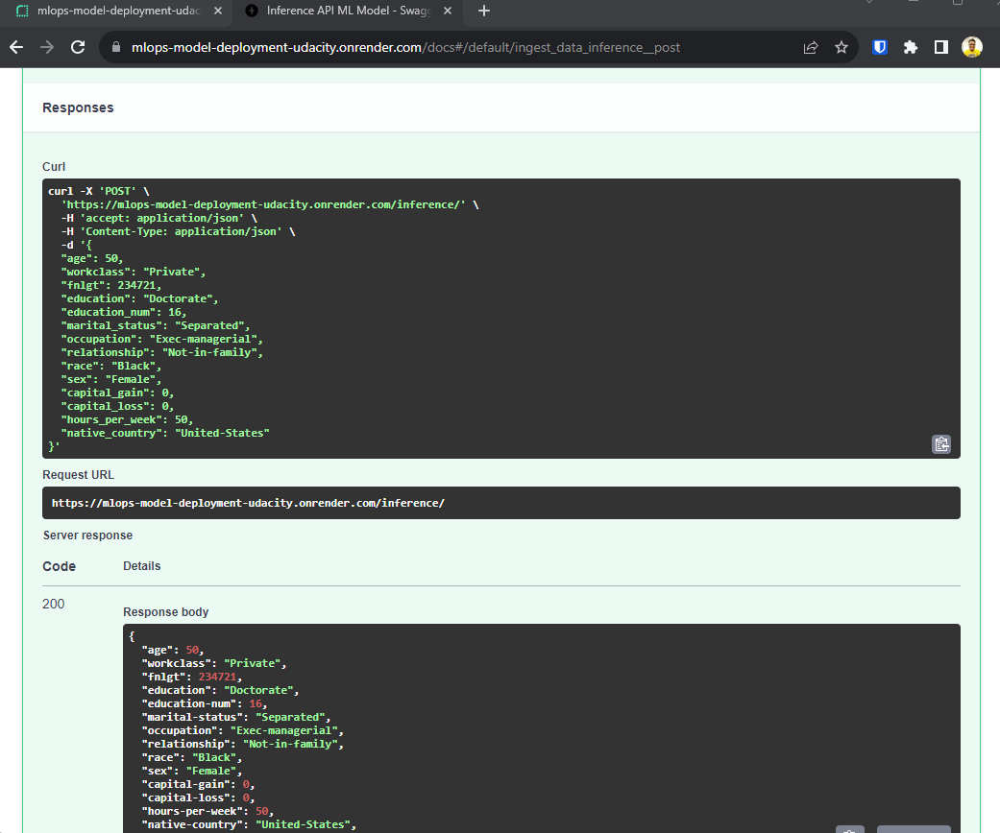

# Deploy a ML model with FastAPI on Cloud Platform
This is the project 3 of Udacity's ML DevOps Engineer nanodegree. Objective is to deploy a ML model with FastAPI on Render Cloud Platform.

## The project consists of the following steps:

* **Model Training:**
   - Develop a machine learning model for a classification task. The objective is to predict the salary group of individuals based on 14 different characteristics. The model is trained to classify whether the salary is above or below $50,000. Detailed information about the model and dataset can be found in the [modelCard](https://github.com/akshayDhotre/mlops-model-deployment/blob/main/model_card.md).

* **Model Inference API:**
   - Create a FastAPI application to expose the trained model for making predictions.

* **Deployment using Render:**
   - Deploy the FastAPI application using Render to establish an inference endpoint.

* **Continuous Integration/Continuous Deployment (CI/CD):**
   - Implement a CI/CD workflow using Github actions, the Github repository, and Render integration with Github.
   - The deployment of the application is conditional on passing integrated automated tests. These tests are validated by Github actions whenever there are modifications to the codebase.

# Environment Set up
* Download and install conda if you don’t have it already.
    * Use the supplied requirements file to create a new environment, or
    * conda create -n [envname] "python=3.8" scikit-learn pandas numpy pytest jupyter jupyterlab fastapi uvicorn -c conda-forge
    * Install git either through conda (“conda install git”) or through your CLI, e.g. sudo apt-get git.
    * Setup this repository and use it.

# Using the code
Once repository code and environment is successfully setup please use below instructions for various actions.

* Run local Server
    * Open ternminal with environment activated
    * Run command - "uvicorn main:app"
    * Uvicorn server will be running on http://127.0.0.1:8000 

* Access API documentation
    * Link - http://127.0.0.1:8000/docs
    * You can try various operations available and test APIs

* Train models
  * Run python command from root location of project directory - "python ml/train_model.py"
  * Access logs in file - logs/ml_model.log

* Test code
  * Run command - "pytest"
  * It will find all "test_*.py" files in directory and run them

# Screenshots
## Render webapp continuous deployment

## Live GET API action one Render webapp

## Live POST API action on Render webapp

